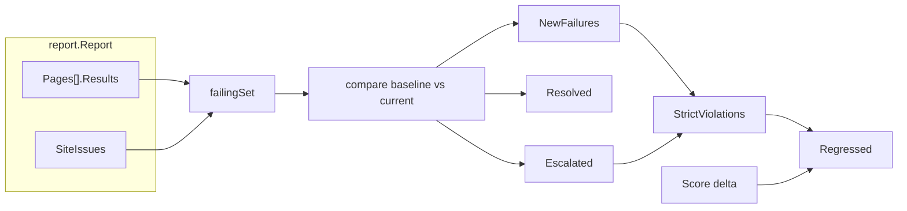

# SEO Audit CLI — Regression Engine

**Scope:** This document covers the regression comparison subsystem only —
baseline file I/O, the diff model, gating policy, escalation detection, and
how `crawl --baseline` and `compare` wire it into exit codes. It assumes the
report schema described in [report-schema.md](report-schema.md) and the
one-directional pipeline: Crawler → Parser → Checks → Scoring → Report →
Regression. The regression package never reaches back into checks or scoring.

---

## 1. Pipeline position




**Decision:** regression operates on serialized `Report` values, not live crawl
state.

*Rationale:* the CI runner stores `<job-dir>/latest.json` between runs. Loading,
comparing, and saving reports keeps the regression engine testable without
network access and decouples it from the crawler.

---


## 2. The diff model

Each report is reduced to a set of **failing findings** keyed by
`(URL, CheckID, Detail)`:


| Source                                 | CheckID           | Detail     |
| -------------------------------------- | ----------------- | ---------- |
| Page check with Warning/Error severity | check's ID        | empty      |
| Duplicate title on a URL               | `DUPLICATE_TITLE` | empty      |
| Broken link from a page                | `BROKEN_LINK`     | target URL |


**Decision:** use set difference over failing entries, not a per-check severity
walk.

*Rationale:* duplicate titles and broken links live in `SiteIssues`, not in
`Pages[].Results`, and carry zero score weight. Folding them into the same set
as page checks lets one comparison path handle all eight v1 check types.

The `Detail` field widens the key when a page has several broken links to
different targets. Without it, only one broken link per source page would
survive deduplication.

Site findings enter the set as `Error` with deduction 0 — honest about their
score impact, and escalation (which compares severity/deduction) never fires on
them.

---


## 3. The four outputs


| Output             | Meaning                                                                   |
| ------------------ | ------------------------------------------------------------------------- |
| `NewFailures`      | In current, absent from baseline (PASS→FAIL or first-seen)                |
| `Resolved`         | In baseline, absent from current, URL still crawled this run              |
| `Escalated`        | In both, but severity rank or deduction increased                         |
| `StrictViolations` | Subset of new failures + escalations whose CheckID is in `--strict-rules` |


**Resolved messages come from the baseline side.** A currently-passing check
returns an empty message, so pulling from current would print blank entries.

**Vanished pages are skipped.** A baseline failure on a page not crawled this
run is not counted as resolved — it may be unreachable, not fixed.

All four slices are sorted by URL, then CheckID, then Detail, before return.

---


## 4. The gating policy

```text
Regressed = ScoreDropExceeded || len(StrictViolations) > 0
```

where `ScoreDropExceeded = Delta < -maxScoreDrop` (strict less-than: a drop of
exactly `maxScoreDrop` is tolerated).

**Decision:** drop the original "any new failure fails the build" rule.

*Rationale:* on a content-managed site, author-level checks (`TITLE_LENGTH`,
`META_DESCRIPTION`, `IMAGE_ALT`) fire constantly from routine edits. Blocking
deploys on every new title-length warning causes teams to disable the gate.

**Decision:** default `--strict-rules` to template-level checks only.


| Default strict (gate on new failure or escalation)                                     | Advisory (score only)                           |
| -------------------------------------------------------------------------------------- | ----------------------------------------------- |
| `TITLE_EXISTS`, `SINGLE_H1`, `VIEWPORT`, `CANONICAL`, `BROKEN_LINK`, `DUPLICATE_TITLE` | `TITLE_LENGTH`, `META_DESCRIPTION`, `IMAGE_ALT` |


Template-level checks are rendered by code and essentially never fail on
purpose. Author-level checks are left to the score gate.

Pass `--strict-rules ""` to disable strict enforcement entirely (pure score-drop
gate).

### Score dilution

`ScoreSite` averages page scores with integer division. On a 100-page site
scoring 100 throughout, one page collapsing to 0 moves the site score to 99 — a
1-point drop. Five pages could break completely and land exactly at -5, which
the strict `<` comparison tolerates. Site issues carry no score weight at all.

This is why `--strict-rules` carries the gate's real enforcement for structural regressions, and why escalation detection matters for checks that were already failing.

---


## 5. Escalation

Four page checks have more than one failing tier (`SINGLE_H1`, `VIEWPORT`,
`IMAGE_ALT`, `META_DESCRIPTION`). A check that was already failing can get
worse without appearing in `NewFailures` — the `(URL, CheckID)` key is
identical.

An entry is **escalated** when, for a key present in both failing sets:

```text
severityRank(current) > severityRank(baseline)  OR  current.Deduction > baseline.Deduction
```

Both clauses are required. `IMAGE_ALT` at 45% missing gives `Warning`/deduction
5; at 50% it gives `Error`/deduction 5 — same deduction, worse severity.
`META_DESCRIPTION` out-of-range deducts 3; missing deducts 5 — same severity,
higher deduction.

De-escalation (`Error`→`Warning`, a partial fix) satisfies neither clause and
is ignored.

**Rejected:** adding severity to the failure key. That would make an escalation
appear simultaneously in `NewFailures` and `Resolved`, printing "resolved" at the
moment the page got worse.

---


## 6. Baseline lifecycle

1. **Load before crawl** — corrupt or schema-mismatched baselines fail fast
  (exit 2) before `--max-duration` is spent.
2. **Missing file = first run** — `LoadBaseline` returns a zero-value report;
  `Compare` short-circuits when `baseline.SchemaVersion == 0`.
3. **Compare after report write** — regression output goes to stderr for
  `crawl` (stdout must stay pure JSON when `--output json`).
4. **Save after compare** — today's report becomes tomorrow's baseline
  regardless of pass/fail.
5. **Atomic write** — `SaveBaseline` writes to `path.tmp` then renames.

The baseline file is a standard `crawl --output json` report — no separate
schema. See [report-schema.md](report-schema.md).

---


## 7. Exit codes and error style


| Code | Meaning                                                                 |
| ---- | ----------------------------------------------------------------------- |
| 0    | Pass — score gate and regression gate both satisfied                    |
| 1    | Gate failure — score below `--fail-below` or regression detected        |
| 2    | System/CLI error — crawl failure, corrupt baseline, unknown strict rule |


**Decision:** `return err` for exit-2 paths inside `RunE`; `os.Exit(1)` only
for gate failure.

*Rationale:* `Execute()` maps returned errors to exit 2. Gate failure (exit 1)
cannot be expressed as a returned error. Returning errors also makes corrupt-
baseline paths unit-testable without a subprocess harness.

---


## 8. Determinism

Map iteration order is nondeterministic in Go. All diff output slices are sorted
before return so two runs over identical input produce byte-identical text
output. This matches the crawler's determinism goal in
[crawler-architecture.md](crawler-architecture.md).

---


## 9. Known limitations

Deliberate non-goals for v1:

- Pages present only in the baseline are skipped, not reported as "vanished."
- Same-tier, same-deduction message changes are invisible.
- A broken link's HTTP status changing (500→404) keys identically and is not a
degradation.
- Site findings carry no score weight; only strict rules catch them.
- Per-page score dilution remains; a future `--max-page-score-drop` flag is
recorded as a Stage 12 follow-up.

Stage 12 follow-ups also include consolidating `severityRank` helpers scattered
across `report` and `regression` into `checks`, and aligning the landed
`crawl error:` path with the `return err` convention.